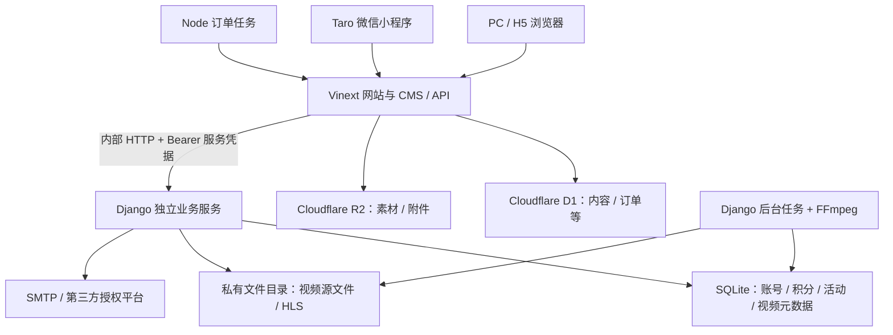

# 项目技术栈方案与实现现状

> 核对日期：2026-09-10。依据：当前工作区源码、依赖清单、配置及《产品需求文档》V2.4.9。
> 本文描述现有技术方案，不代表新增选型或生产验收。版本以项目声明为主；本轮未安装依赖、启动服务、运行测试或部署。

## 1. 总体结论

本项目采用 **React / TypeScript 网站与 CMS + Cloudflare D1 / R2 + Python Django 独立服务 + Taro 微信小程序** 的组合架构。

它包含两套客户端、两个服务执行环境和两套业务数据库：

| 部分 | 核心技术 | 承担职责 |
| --- | --- | --- |
| 网站前台与管理后台 | React 19、TypeScript、Vinext、Vite、Tailwind CSS | 中英文 PC/H5 网站、内容编辑、商品交易、后台管理 |
| 网站接口层 | Vinext Route Handlers、Cloudflare Workers API | CMS 接口、订单库存、素材访问、对 Django 服务的代理与业务协调 |
| CMS 数据及对象存储 | Cloudflare D1、R2、Drizzle | 内容、订单、库存相关数据、公开及受控附件 |
| 独立业务服务 | Python、Django、SQLite | 访客与管理员身份、第三方授权、营销活动、积分、私有视频 |
| 微信小程序 | Taro 4、React 18、TypeScript、Webpack 5 | 小程序装修展示、阅读、账号、购物车、线下交易与积分兑换 |
| 后台任务 | Node.js 脚本、Django 管理命令、FFmpeg | 订单过期、积分补偿、活动奖励、邮件通知、视频转码 |

**架构判断：** 网站页面与网站 API 位于同一工程；Django 通过内部 HTTP API 提供独立服务；小程序通过网站 API 访问业务能力。当前不是全部业务集中于 Django 的单体系统，也不是已经完成容器化的私有部署系统。

图中连线表示代码架构，不表示所有外部服务均已配置或完成真实验收。

## 2. 网站前端与页面框架

| 技术 | 声明版本 | 具体作用 | 核对状态 |
| --- | --- | --- | --- |
| React / React DOM | 19.2.8 | 页面组件、状态、交互及界面渲染 | 业务使用 |
| TypeScript | 5.9.3 | 页面、接口和数据结构类型检查 | 业务使用；开启 strict |
| JavaScript ES Modules | `.mjs` / `type: module` | 可独立测试的领域规则、后台任务 | 业务使用 |
| Vinext | 1.0.0-beta.5 | 提供 Next.js 风格路由和服务端渲染能力 | 实际开发、构建入口 |
| Vite | 8.0.16 | 开发服务器、模块构建和插件协调 | 构建使用 |
| React Server Components 配套 | react-server-dom-webpack 19.2.8；Vite RSC 插件 0.5.26 | 服务端组件相关运行及构建支持 | 依赖与 rsc/ssr 配置存在 |
| Tailwind CSS | 4.2.1 | 工具类样式、响应式布局、主题变量 | 业务使用 |
| Tailwind PostCSS 插件 | 4.2.1 | Vite 样式编译 | 配置启用 |
| Lucide React | 1.31.0 | 导航、按钮等图标 | 业务使用 |

### 2.1 为什么代码中有 Next.js，但依赖核心是 Vinext

代码使用 `next/headers`、`next/server` 等接口，目录采用 `app/` 路由，存在 `next.config.ts`。但是根依赖清单没有直接声明独立的 `next` 包，启动命令是 `vinext dev`，构建命令是 `vinext build`。

因此应准确记录为 **Vinext 提供的 Next.js 兼容架构**，不能根据文件名推断为某个版本的官方 Next.js 项目。Vinext 当前声明为 beta 版本；后续升级需要验证兼容性。

### 2.2 页面组织

- `app/[lang]/`：中英文前台，包含内容、购物车、订单、积分商城、视频及账号等页面。
- `app/admin/`：独立后台入口与登录相关页面；部分管理组件继续位于 `app/manage/`。
- `app/api/`：网站及小程序接口。
- `components/`：公共组件和 UI 基础组件。
- `lib/`：领域规则、数据访问辅助、服务调用及页面辅助代码。
- `middleware.ts`：语言请求头、安全响应头、后台禁止索引及缓存控制。

语言通过路径与业务字段组织；中英文内容在业务数据中分别维护。本轮未发现必须依赖独立国际化框架的实现依据。

证据：`package.json`、`vite.config.ts`、`next.config.ts`、`tsconfig.json`、`app/`、`middleware.ts`。

## 3. UI 组件、富文本与媒体呈现

| 技术 | 版本 | 用途及采用程度 |
| --- | --- | --- |
| Base UI React | 1.7.0 | UI 交互基础；组件体系依赖 |
| shadcn / @shadcn/react | 4.18.0 / 0.3.0 | 本地 UI 组件体系与工具；配置为 base-nova 风格 |
| class-variance-authority | 0.7.1 | 管理组件样式变体 |
| clsx / tailwind-merge | 2.1.1 / 3.6.0 | 条件类名拼接及 Tailwind 类名冲突合并 |
| tw-animate-css | 1.4.0 | CSS 动画样式支持 |
| Tiptap React、StarterKit、Image、Table、PM | 3.31.3 | 管理后台结构化富文本编辑，支持图片与表格 |
| hls.js | 声明 ^1.7.2，锁文件为 1.7.2 | 网站视频播放器加载 HLS；业务代码动态导入 |
| Embla Carousel React | 8.5.2 | 轮播基础组件封装存在 |
| Recharts | 3.8.0 | 图表基础组件封装存在 |
| React Day Picker | 9.8.1 | 日历基础组件封装存在 |
| cmdk | 1.1.1 | 命令菜单基础组件封装存在 |
| input-otp | 1.4.2 | 验证码输入基础组件封装存在 |
| react-resizable-panels | 4.5.8 | 可调尺寸面板基础组件封装存在 |
| date-fns | 4.1.0 | 已声明日期处理依赖；本轮未找到业务直接导入 |

“基础组件封装存在”只表示仓库有对应实现，不代表已经进入当前业务页面或构成已验收功能。不能仅凭 Recharts 或验证码组件依赖，就声称完整分析看板或短信登录已经落地。

正文使用结构化富文本与自定义渲染、校验逻辑。网站和小程序各有渲染实现；发布前检查内容结构及有效正文。当前规则允许有效图片或视频构成正文，不能沿用旧的纯文字必填判断。

证据：`components.json`、`components/ui/`、`app/manage/rich-editor.tsx`、`lib/rich-view.tsx`、`lib/publication.mjs`、`app/video-public.tsx`。

## 4. 网站服务端与 API

### 4.1 执行环境

| 项目 | 技术 / 版本 | 说明 |
| --- | --- | --- |
| 本地 JS 工具运行环境 | Node.js >=22.13.0 | package.json 声明的最低要求，非本轮实测安装版本 |
| 网站服务执行接口 | Cloudflare Workers | 代码直接导入 cloudflare:workers，读取 DB / FILES 等绑定 |
| Cloudflare Vite 插件 | 1.37.1 | 连接 Vite、RSC/SSR 与 Worker 本地运行环境 |
| Wrangler | 4.92.0 | Worker 本地运行工具；start 使用构建产物配置 |
| Workers 类型声明 | 4.20260515.1 | TypeScript 平台类型，不是服务端部署版本 |
| Sites Vite 插件 | 0.2.0 | 已有 Sites 工程集成 |

### 4.2 接口与业务组织

API 使用 `app/api/**/route.ts`，基于标准 `Request`、`Response`、`fetch` 和 JSON。未看到 Express、NestJS 或 Fastify 作为本项目服务框架的依据。

主要接口组包括管理员、访客、第三方授权、内容管理、素材上传、表单、订单、积分、活动、视频及小程序。不同接口按业务返回数据与错误，不宜将其描述为已统一实现包含 success/data/pagination 的标准响应封装。

`lib/identity.ts` 使用内部地址和 Bearer 服务凭据调用 Django，对普通请求与 OAuth 完成请求设置不同超时。服务凭据只在服务端使用，不能传给小程序或浏览器。

证据：`app/api/`、`lib/server.ts`、`lib/identity.ts`、`vite.config.ts`。

## 5. 数据库与文件存储

### 5.1 CMS 数据库：Cloudflare D1

| 技术 | 版本 / 配置 | 用途 |
| --- | --- | --- |
| Cloudflare D1 | DB 绑定；SQLite 方言 | CMS 和订单业务数据库 |
| Drizzle ORM | 0.45.2 | Schema 定义及 D1 适配入口 |
| Drizzle Kit | 0.31.10 | 从 Schema 生成 SQL 迁移 |
| D1 原生 prepare / bind / batch | 平台 API | 大量实际业务查询、参数绑定及批处理 |
| SQLite 索引与触发器 | 迁移 SQL | 唯一性、内容引用、渠道限制及库存约束 |

现有数据范围包括内容、分类、网站设置、素材元数据与引用、导航、政策、表单提交、访问记录、审计日志、购物车、地址、订单、订单项、附件及订单历史。

数据结构混合使用独立列和 JSON 文本字段。Drizzle 是现有工具链的一部分，但大量业务直接执行参数化 SQL，不能说所有查询均经 ORM 或已经实现统一 Repository 层。

当前可见 D1 迁移从 `0000` 到 `0013`。最新库存逻辑已有 SKU 占用、扣减、退回保护；旧文档的商品共享库存描述不能覆盖后续规格库存修订。

### 5.2 独立服务数据库：SQLite

Django 使用 `django.db.backends.sqlite3`，数据库位于私有数据目录，文件名为 `identity.sqlite3`。通过 Django ORM 和 migrations 管理账号、会话、活动、积分与视频等数据。

这与 CMS 的 D1 是两套数据库。现金订单与积分账本等操作跨服务协调，不能假定有跨库 ACID 事务。现有代码采用持久化待处理记录、幂等操作、重试和补偿；并发压力、故障恢复及生产任务监督仍需专项验收。

### 5.3 文件存储分层

| 文件类别 | 当前存储路径 / 机制 | 访问方式 |
| --- | --- | --- |
| 通用素材 | R2，FILES 绑定 | 专用媒体路由及内容引用检查 |
| 表单、订单凭证等附件 | R2 与数据库元数据关联 | 专用路由校验身份和权限 |
| 视频原件、转码分片和密钥 | Django 私有文件目录 | 视频授权接口；不走公开素材原件接口 |
| 本地数据库、服务配置 | private-data 等被忽略目录 | 文件系统权限保护 |
| 本地 Cloudflare 状态 | .wrangler | 本地开发状态，不能当作生产数据库备份方案 |

普通素材上传接口限制 30 MB，检查 MIME、大小和文件头；私有视频使用另一套大文件上传流程，不能混用上传上限。

证据：`db/index.ts`、`db/schema.ts`、`drizzle.config.ts`、`drizzle/`、`app/api/upload/route.ts`、`identity/config/settings.py`、`lib/redemption.ts`。

## 6. Django 独立服务

| 技术 | 固定版本 | 作用 |
| --- | --- | --- |
| Python | 仓库未明确统一锁定版本 | Django 与视频、邮件、积分任务的运行语言 |
| Django | 5.2.17 | ORM、密码体系、HTTP 接口、迁移、测试及管理命令 |
| asgiref | 3.12.1 | Django 异步接口基础依赖 |
| sqlparse | 0.6.0 | Django SQL 解析基础依赖 |
| segno | 1.6.6 | 二维码生成，用于活动等业务 |
| cryptography | 50.0.1 | 第三方配置加密和微信支付安全基础函数 |

虽然目录名为 identity，服务职责已扩展到：

1. 访客邮箱注册、验证、登录、重置密码及账号状态。
2. 独立管理员、角色权限、首次改密和会话。
3. 第三方身份、真实 OAuth 流程与微信小程序登录；历史模拟入口已按后续需求关闭或移除。
4. 沙龙活动、报名、签到、通知队列。
5. 积分账户、规则、流水、互动、收藏及奖励结算。
6. 私有视频素材、系列分集、转码任务、播放授权与观看记录。

服务使用自定义 JSON HTTP API，没有 Django REST Framework 依赖依据。其 `MIDDLEWARE=[]`，不能写成已启用 Django 默认 Session / CSRF 中间件；相应会话和请求保护由项目自定义逻辑承担。

证据：`identity/requirements.txt`、`identity/config/settings.py`、`identity/accounts/models.py`、`identity/accounts/`。

## 7. 登录、权限与安全机制

| 范围 | 当前实现 | 说明 |
| --- | --- | --- |
| 管理员身份 | Django StaffAccount / StaffSession；geo_staff Cookie | 独立后台账号，首次登录强制改密，按角色检查权限 |
| 访客身份 | 自定义 Session、验证和重置 Token；geo_visitor Cookie | 会话和一次性令牌摘要存储；Cookie 设置由接口控制 |
| 服务间鉴权 | Bearer 内部服务凭据 | 网站到 Django 的受控调用 |
| 请求来源保护 | 网站接口 Origin 同源检查 | 按接口实现，不能据此声明全部入口通过安全审计 |
| 请求校验 | 类型、长度、业务状态、上传大小及格式检查 | 主要为项目自定义逻辑，未使用统一 Zod 依赖 |
| 限流 | D1 rates 和 Django Throttle 等 | 数据库支持的限流实现 |
| 数据访问 | 参数绑定、ORM、权限判断、唯一约束 | 不代表已做完整渗透测试 |
| 视频保护 | 短期凭证、分片与密钥鉴权、并发限制、水印 | 基础访问保护；不是 DRM，也不保证防录屏 |
| 敏感配置 | 忽略文件、私有目录权限及部分字段加密 | SMTP 配置为文件权限保护，不能称为全部静态加密 |

**旧方案取代关系：** 需求文档早期记载 CMS 依赖 Sites / ChatGPT 管理员身份，V1.7 的 AUTH-001 已明确取代该方案。当前 `lib/server.ts` 的 `admin()` 从 geo_staff 读取会话并调用 Django `staff-session`。仓库残留的 ChatGPT 导入或旧辅助文件不应被当作当前主认证流程。

## 8. 第三方接入与视频任务

| 服务 / 能力 | 当前技术方案 | 落地边界 |
| --- | --- | --- |
| 邮件 | Django 邮件能力及自定义 TLS 处理；SSL 465 / STARTTLS 587 | 有 SMTP 配置与发送实现；是否真实投递成功须单独验证 |
| Google / Facebook / 网站微信登录 | 服务端 OAuth；授权 state、回调、绑定和资料补全 | 真实协议代码已存在；不等于三个平台真实授权均已验收 |
| 微信小程序登录 | Taro 登录入口与服务端微信会话交换、账号绑定 | 已有实现；需求文档有用户反馈真实登录成功，完整跨端场景仍需验收 |
| 微信支付 | cryptography 支持的 RSA 签名 / 验签、AES-GCM 解密基础 | 未完成预支付、回调核销、关单、退款及对账闭环；当前不启用 |
| 线下支付 | 收款说明、凭证上传、管理员审核与履约 | 已实现；小程序完整交易流程仍待启用配置后验收 |
| 视频转码 | FFmpeg / ffprobe 外部可执行程序 | 本地实现；仓库未锁定二进制版本 |
| 视频播放 | HLS、加密分片、hls.js、私有播放接口 | 有本地播放与转码历史证据；完整终端与生产验收有待办 |

真实 OAuth 的代码证据位于 `identity/accounts/oauth.py`：Google 使用授权码与 PKCE S256；Facebook 代码使用 v23.0 接口与 appsecret_proof；网站微信使用 qrconnect 扫码授权，小程序则通过 jscode2session 交换登录凭据。

`identity/README.md` 早期“仅模拟、未实现真实授权”及启用沙箱的说明已过时。当前 settings 将 IDENTITY_SANDBOX 设为 False，需求文档 V2.3 记录移除模拟入口；不能按旧 README 将模拟登录视为当前可用方案。

后台任务采用数据库队列与循环管理命令，没有引入 Celery / Redis 的依据：

| 任务入口 | 职责 |
| --- | --- |
| scripts/order-expiry-worker.mjs | 周期调用订单过期接口，相关接口同时承担待处理恢复工作 |
| identity/manage.py salon_mail_worker | 活动通知邮件任务 |
| identity/manage.py points_worker | 活动结束后的积分奖励结算 |
| identity/manage.py video_worker | 读取视频任务并执行 FFmpeg 转码 |
| identity/manage.py init_staff | 初始化管理员；不是常驻队列任务 |

这些脚本和命令存在，不代表当前进程正在运行或已有生产进程守护。私有视频库支持 8 MiB 分块、单文件 1 GiB（1,073,741,824 字节）、时长不超过 4 小时；旧直传入口另有 200 MiB 上限，应以实际入口为准。转码代码使用 H.264 / AAC、HLS VOD、6 秒分片及加密密钥，最大输出宽度为 1280。

## 9. 微信小程序技术栈

| 技术 | 版本 / 配置 | 用途 |
| --- | --- | --- |
| Taro 核心、运行时、组件、React 适配 | 4.2.1 | React 到微信小程序的开发与编译体系 |
| React | 18.3.1 | 小程序组件层，与网站 React 19 分离 |
| TypeScript | 5.9.3 | 小程序类型检查 |
| Webpack | 5.91.0 | 小程序编译；Taro 配置指定 webpack5 |
| Babel | core ^7.24.0；preset-react ^7.29.7；preset-taro 4.2.1 | 源码转换 |
| Sass / PostCSS | ^1.77.0 / ^8.4.0 | SCSS 样式及转换 |
| Taro pxtransform | 已启用，设计宽度 375 | 小程序尺寸适配 |
| 微信开发者工具 | 版本未在工程统一锁定 | 编译包导入、调试和预览 |

工程位于 `miniapp/`，有独立 `package.json`、workspace 和锁文件，产物为 `miniapp/dist/`。网站与小程序不共享同一套 React 依赖解析。

API 地址由编译环境变量 `MINI_API_ORIGIN` 注入，必须是 HTTPS 域名。后台修改记录不会自动改变已编译客户端的可信 API 地址；地址变更需要重新构建。AppSecret 保留服务端，小程序工程不应包含它。

当前实现包括后台发布装修配置、最多五项动态导航、文章商品列表与详情、互动、账号、游客购物车暂存及登录合并、报价与下单恢复、地址、线下付款凭证和积分兑换。内容须满足发布与小程序渠道规则，网站发布不自动等于小程序可见。

最新 V2.4.9 记录明确：微信支付未开通，前端隐藏；小程序线下付款开关当时关闭，完整下单至收货流程尚未执行。此为文档记录，本轮没有读取实时后台配置。开发者工具局部验证不等于 iPhone / Android 真机全流程通过。

证据：`miniapp/package.json`、`miniapp/config/index.ts`、`miniapp/README.md`、`miniapp/src/`、需求文档 V2.4.9。

## 10. GEO / SEO 与内容渠道

- 通过中英文路由和服务端页面输出组织可访问内容。
- `app/sitemap.xml/route.ts` 生成站点地图；`app/robots.txt/route.ts` 提供抓取规则。
- 内容页面包含 schema.org JSON-LD 结构化数据。
- 后台及相关接口设置禁止索引策略。
- 网站与小程序有独立渠道发布控制，配合自定义配置与内容校验。

这些是内容可发现性的工程基础，不能证明搜索排名或 AI 引用效果。当前未发现模型 SDK、向量数据库、RAG 检索管线作为核心业务栈的依据，不能因产品名称含 GEO 就将这些列为已实现技术。

## 11. 开发、测试与代码质量

| 工具 | 版本 / 命令 | 当前用途 |
| --- | --- | --- |
| pnpm | 仓库有双端锁文件，未统一声明版本 | 依赖管理；项目协作要求优先使用 |
| Node.js 原生测试 | npm test → node --test tests/*.test.mjs | 网站领域规则及部分数据库约束测试 |
| 小程序原生测试 | pnpm --dir miniapp test | 小程序业务逻辑与页面边界回归 |
| Django Test Runner | identity/manage.py test accounts | 身份、活动、积分、视频等测试 |
| TypeScript | 网站 tsc --noEmit；小程序 typecheck | 两端独立类型检查 |
| Oxlint | 1.76.0 | lint 脚本 |
| oxlint-tsgolint | 7.0.2001 | 已声明类型感知 lint 配套依赖 |
| Oxfmt | 0.61.0 | format 脚本 |
| 浏览器 / 微信开发者工具 | 历史人工或工具操作记录 | 页面、接口及交互验证 |

本轮是文档整理，没有修改 JavaScript，也没有重新执行测试、构建或覆盖率统计。需求文档最新记录为网站 109 项、小程序 12 项测试通过，并记录两端类型检查与构建通过；这是历史证据，不能视为本轮复测。

项目约定要求 80% 覆盖率，但最新需求记录明确未统计全项目覆盖率；因此不能宣称已达到该门槛。根测试命令只匹配指定目录的 `.test.mjs`，不能将其他脚本或浏览器场景自动算入执行范围。

## 12. 本地运行与生产部署边界

### 12.1 现有本地运行方案

| 部分 | 已有入口 | 说明 |
| --- | --- | --- |
| 网站开发 | npm run dev -- --port 3001 | Vinext 开发服务器 |
| Django 开发 | .venv/bin/python identity/manage.py runserver 127.0.0.1:3002 --noreload | 内部开发服务 |
| 网站构建 | npm run build | Vinext 构建 |
| 构建产物本地运行 | npm start | wrangler dev --config dist/server/wrangler.json；不是生产部署命令 |
| 数据迁移生成 | npm run db:generate | 只生成 D1 迁移，不等于已应用 |
| Django 迁移 | .venv/bin/python identity/manage.py migrate | 修改数据库，需按实施范围执行 |
| 小程序构建 | pnpm --dir miniapp build | 生成微信开发者工具使用的包 |

以上用于说明已有命令，不代表本轮执行或确认服务可用。需求记录中的临时 HTTPS 转发和素材请求兼容修复属于小程序本地联调设施，不能当作正式网关方案。

### 12.2 生产 Docker 部署方案状态

产品目标是支持 Docker 的私有化部署。当前已补齐方案文档：[生产 Docker 部署方案](生产Docker部署方案.md)。该方案明确推荐首期采用单机 Docker Compose、Nginx HTTPS 入口、Node standalone Web 服务、Django Gunicorn 身份服务、PostgreSQL、共享持久化文件卷，以及视频、积分、订单过期、图片衍生和备份等独立 worker 容器。

当前状态仍是“方案已补齐，尚未实施”：仓库尚未交付经过验收的 Dockerfile / Compose / Nginx 模板，生产也未部署。方案中的 Compose 片段只是结构草案，不能直接复制上线。

后续实施仍需逐项完成并验收：

1. Web 与 Identity 生产镜像、非 root 运行用户、健康检查和构建产物裁剪。
2. PostgreSQL 初始化、最小权限角色、CMS 与身份数据库迁移。
3. 共享文件卷、私有视频、订单凭证、头像和图片衍生版本的挂载边界。
4. 转码、通知、订单和积分任务的常驻托管、失败告警与恢复。
5. 正式域名、HTTPS、OAuth 回调、小程序合法域名、SMTP、订阅消息及支付接入。
6. 备份恢复演练、代码回滚、数据库恢复预案、并发库存压力和终端兼容验收。

Nginx、Gunicorn 和 PostgreSQL 已在 UAT 使用；生产 Docker 采用这些组件仍需通过容器化实施和生产验收后才能标记为已交付。Redis、Celery、Kubernetes、云托管数据库和对象存储不是首期强制选型，若引入需另行确认生产依赖和迁移方案。

## 13. 当前方案的关键理解

| 关键点 | 对后续开发的影响 |
| --- | --- |
| 网站 React 19，小程序 React 18 | 两端依赖独立维护，不能直接统一升级 |
| Vinext 的 Next.js 兼容架构 | 新功能需核对 Vinext 与 Worker 支持范围 |
| CMS D1 与 Django SQLite 分离 | 跨服务交易需要幂等、恢复记录和补偿 |
| 普通素材与私有视频分离 | 上传、访问权限、文件生命周期分别处理 |
| 自定义管理员和访客会话 | 不能套用 Sites 身份或 Django 默认 Session 假设 |
| 数据库队列与自编任务 | 生产阶段需明确进程守护、监控和失败处理 |
| 有真实接入代码，不等于已验收 | OAuth、小程序与支付按渠道分别核对 |
| 本地实现与私有化目标有距离 | 生产部署需单独授权及设计 |

## 14. 证据索引与维护说明

| 需要核对的内容 | 仓库文件 |
| --- | --- |
| 网站技术与版本 | package.json、pnpm-lock.yaml |
| 编译、Worker 与 Sites 集成 | vite.config.ts、next.config.ts |
| 类型、样式、组件体系 | tsconfig.json、components.json、app/globals.css |
| CMS 数据与迁移 | db/schema.ts、db/index.ts、drizzle.config.ts、drizzle/ |
| 网站权限与服务调用 | lib/server.ts、lib/identity.ts、app/api/staff/ |
| 订单、兑换与恢复 | lib/orders.ts、lib/redemption.ts、lib/order-points.ts、scripts/order-expiry-worker.mjs |
| Django 技术与数据模型 | identity/requirements.txt、identity/config/settings.py、identity/accounts/models.py |
| OAuth 与支付边界 | identity/accounts/oauth.py、identity/accounts/wechat_pay.py |
| 视频处理 | identity/accounts/videos.py、video_library.py、video_http.py、management/commands/video_worker.py |
| 小程序 | miniapp/package.json、miniapp/config/index.ts、miniapp/README.md |
| 实现、历史测试与待验收项 | docs/产品需求文档.md V2.4.9 |

本文是技术现状说明，不替代需求基线。新增依赖、调整认证、替换存储、升级主框架或确定部署选型后，应按实际代码更新本文件；业务需求的确认与验收状态仍以产品需求文档维护为准。
