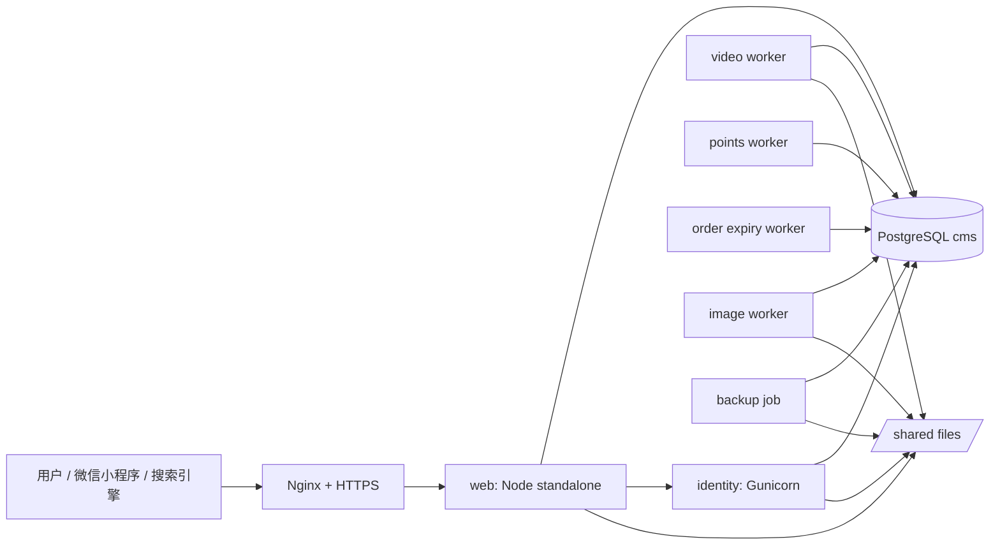

# 生产 Docker 部署方案

版本：V1.0，2026-09-22  
适用项目：`mysite_codex`  
状态：方案已补齐，尚未实施；不代表生产已部署或验收通过。

## 1. 目标与边界

生产 Docker 部署用于把当前系统从本地 / UAT 的手工服务编排，收敛为可复制、可回滚、可备份的私有化部署形态。目标是支持独立服务器或云主机上的 Docker Compose 部署，并保留未来迁移到 Kubernetes 的边界。

本方案覆盖：

- PC / H5 网站和后台的 Node standalone 服务。
- Django 身份、会员、视频、通知、积分及营销相关服务。
- PostgreSQL 作为 CMS 与身份业务的生产数据库。
- 公共素材、私有视频、头像、订单凭证、图片衍生版本等持久化文件。
- Nginx / HTTPS 入口、后台任务、备份、恢复、发布与回滚。
- 小程序生产 API 域名的构建与微信合法域名配置。

本方案不包含：

- 真实生产部署执行。
- 真实域名、证书、密码、AppSecret、SMTP 授权码、微信支付密钥或短信服务商密钥。
- 未经后台操作者主动发起的微信小程序上传、自动启用微信支付或自动迁移真实会员 / 交易数据。
- Kubernetes、云厂商托管数据库、对象存储和 CDN 的最终采购决策。

## 2. 推荐部署形态

首期生产推荐使用单机 Docker Compose，外部只暴露 80 / 443，由 Nginx 反向代理内部服务。数据库和文件持久化使用宿主机卷，避免容器重建导致数据丢失。



生产容器建议拆分为：

| 服务 | 职责 | 对外暴露 |
| --- | --- | --- |
| `nginx` | HTTPS、静态安全头、上传大小、反向代理 | 80 / 443 |
| `web` | PC / H5 / 后台 / 小程序 API 聚合、CMS 业务 | 仅容器网络 |
| `identity` | Django 身份、会员、视频授权、营销、通知相关接口 | 仅容器网络 |
| `postgres` | CMS 与身份业务数据库，建议同实例不同库与角色 | 仅容器网络 / 运维内网 |
| `video-worker` | 视频转码、HLS 加密分片生成 | 仅容器网络 |
| `points-worker` | 沙龙签到后积分、表单补发等积分任务 | 仅容器网络 |
| `expiry-worker` | 订单超时关闭、库存释放等定时任务 | 仅容器网络 |
| `image-worker` | 图片 WebP 衍生版本异步生成 | 仅容器网络 |
| `backup` | 定时一致性备份与保留策略 | 仅容器网络 |

Redis / Celery 不是首期强制依赖。当前代码已有数据库队列与自编 worker，首期先以独立 worker 容器托管；后续若要接入 Celery，需要单独确认生产依赖和迁移边界。

## 3. 镜像与构建

生产应构建两类业务镜像。

### 3.1 Web 镜像

Web 镜像包含 Node 运行时、`dist/standalone` 产物、必要脚本和生产依赖。构建流程建议为：

1. 使用 Node 24 LTS 或与 UAT 已验证版本一致的 Node 版本。
2. 安装依赖时使用锁文件，不在镜像构建中读取本地 `.env`、`private-data` 或 SSH 密钥。
3. 执行 `npm run build:uat` 或后续改名为 `build:node` 的 Node 目标构建。
4. 只复制 standalone 运行产物、`scripts/` 中生产 worker 必需脚本、`package.json` 和必要依赖。
5. 镜像内使用非 root 用户运行。

当前 Docker Web 构建已增加小程序编译：使用 `MINI_API_ORIGIN=https://aition.art` 生成 `miniapp/dist` 并随 Web 镜像携带。小程序上传密钥和发布记录使用仅 Web 服务挂载的 `data/mini-release` 持久目录；后台站点所有者可以上传密钥并发起预览或体验版上传。既有镜像需要重新构建才包含这项能力，真实微信平台动作仍需配置代码上传 IP 白名单并验收。

干净拉取后构建时，`docker/web.Dockerfile` 的 `COPY patches ./patches` 要求仓库中存在 `patches/`。即使当前没有补丁，也要保留 `patches/.gitkeep`，不能仅在服务器手工创建空目录；发布前用干净的 Git 导出目录验证 Docker 构建上下文。

Web 镜像不得包含：

- `.dev.vars`、`.env*`、`localmd.md`、`private-data/`。
- `docs/code_s.pem` 或任何 SSH 私钥。
- 本地 `.wrangler`、`.git`、测试截图、备份文件。

### 3.2 Identity 镜像

Identity 镜像包含 Python、Django、Gunicorn、视频处理依赖和身份服务代码。构建流程建议为：

1. 使用 Python 3.12 slim 或与 UAT 一致的版本。
2. 安装 `identity/requirements.txt` 和生产已确认依赖。
3. 安装 FFmpeg / ffprobe，用于视频转码 worker。
4. 使用 Gunicorn 启动 `config.wsgi:application`。
5. 镜像内使用非 root 用户运行。

视频 worker 与身份 API 可以使用同一个镜像，但以不同 command 启动，便于统一版本和依赖。

### 3.3 Nginx 镜像

Nginx 可以使用官方镜像加项目配置。证书可由以下两种方式管理，首期二选一：

- 宿主机或独立 certbot 容器签发证书，挂载到 Nginx。
- 使用云厂商证书或负载均衡终止 HTTPS，Nginx 只接受内网 HTTP。

生产必须明确最终方式。UAT 当前使用 Let’s Encrypt 和主机 Nginx，不等于 Docker 生产已完成。

## 4. 环境变量与密钥管理

生产必须使用独立环境变量文件或密钥管理服务。任何密钥不得写入 Git、镜像、文档或构建日志。

关键变量分组如下：

| 分组 | 变量示例 | 说明 |
| --- | --- | --- |
| Web | `PUBLIC_ORIGIN`、`VINEXT_TRUSTED_HOSTS`、`CMS_DATABASE_URL`、`FILES_DIR`、`IDENTITY_URL`、`IDENTITY_KEY` | 网站、后台与小程序 API 聚合服务 |
| Identity | `IDENTITY_ENV=production`、`IDENTITY_DATABASE_URL`、`IDENTITY_SECRET_KEY`、`IDENTITY_INTERNAL_KEY`、`PUBLIC_ORIGIN`、`IDENTITY_ALLOWED_HOSTS` | Django 身份服务 |
| Admin bootstrap | `INITIAL_ADMIN_USERNAME`、`INITIAL_ADMIN_EMAIL`、`INITIAL_ADMIN_PASSWORD` | 只用于首次创建管理员，已有管理员时不得覆盖 |
| WeChat | 小程序 AppID、AppSecret、订阅消息模板、支付商户配置 | 只保存在服务端环境或受限配置中 |
| SMTP | SMTP 主机、端口、账号、授权码、发件人 | 后台读取时只显示占位，不回显原文 |
| Worker | `ORDER_ORIGIN`、`IMAGE_WORKER_DELAY_MS`、视频并发 / 配额参数 | 后台任务 |

推荐做法：

- `.env.production` 只保存在服务器，权限 `0600`。
- Compose 使用 `env_file` 或 Docker secrets 注入。
- 初始管理员密码只用于首次初始化，创建后立即删除或轮换。
- 生产密钥轮换要有回滚预案，尤其是身份加密密钥和手机号 / openid 加密相关字段。

## 5. 数据库与持久化

生产数据库统一使用 PostgreSQL。建议同一 PostgreSQL 实例中建立两个业务库和两个低权限角色：

| 数据库 | 角色 | 用途 |
| --- | --- | --- |
| `aition_cms_prod` | `aition_cms` | CMS、商品、订单、积分、渠道配置、行为统计 |
| `aition_identity_prod` | `aition_identity` | 会员、账号、视频、营销、通知、权限组 |

文件持久化建议挂载到 `/srv/aition/shared` 或 Compose 命名卷，内部划分：

| 路径 | 用途 | 访问规则 |
| --- | --- | --- |
| `files/` | CMS 公共 / 私有素材及图片衍生版本 | 通过应用鉴权或公开媒体接口访问 |
| `identity/` | Django 私有运行数据 | 仅身份服务与 worker 访问 |
| `videos/originals/` | 私有视频源文件 | 不映射到公网 |
| `videos/streams/` | HLS 加密分片 | 通过授权播放接口访问 |
| `backups/` | 本机短期备份 | 不作为唯一备份位置 |

生产不得把 `videos/originals` 或私有订单凭证目录直接暴露为 Nginx 静态目录。

## 6. 迁移、初始化与启动顺序

首次部署建议流程：

1. 生成生产环境变量和密钥，保存在服务器私有目录。
2. 创建 PostgreSQL 数据库和角色，禁止公网访问数据库。
3. 执行 CMS PostgreSQL 基线和增量迁移。
4. 执行 Django 迁移：`python identity/manage.py migrate --noinput`。
5. 首次创建管理员：`python identity/manage.py init_staff`。
6. 启动 `identity`，检查健康状态。
7. 启动 `web`，检查首页、后台登录、小程序公开接口。
8. 启动 `video-worker`、`points-worker`、`expiry-worker`、`image-worker`。
9. 启用 Nginx HTTPS，检查正式域名、robots、sitemap、登录 Cookie、上传大小。
10. 编译小程序时设置 `MINI_API_ORIGIN=https://生产域名`，并在微信公众平台配置合法域名后真机验收。

容器启动依赖建议：

- `postgres` healthy 后再执行迁移。
- 迁移成功后再启动业务服务。
- worker 可在业务服务之后启动，失败自动重启，但失败不应阻断前台读写。

## 7. Compose 方案草案

下面是结构草案，不能直接复制上线。实际文件需要在实现阶段补齐镜像名、版本、健康检查、密钥路径、备份目录和域名。

```yaml
services:
  postgres:
    image: postgres:16
    restart: unless-stopped
    environment:
      POSTGRES_INITDB_ARGS: "--encoding=UTF8 --locale=C"
    volumes:
      - pgdata:/var/lib/postgresql/data
    networks: [internal]

  identity:
    image: aition/identity:${APP_VERSION}
    restart: unless-stopped
    env_file: ./secrets/identity.env
    volumes:
      - shared:/srv/aition/shared
    depends_on:
      postgres:
        condition: service_healthy
    networks: [internal]

  web:
    image: aition/web:${APP_VERSION}
    restart: unless-stopped
    env_file: ./secrets/web.env
    volumes:
      - shared:/srv/aition/shared
    depends_on:
      identity:
        condition: service_started
    networks: [internal]

  video-worker:
    image: aition/identity:${APP_VERSION}
    command: ["python", "manage.py", "video_worker"]
    restart: unless-stopped
    env_file: ./secrets/identity.env
    volumes:
      - shared:/srv/aition/shared
    networks: [internal]

  points-worker:
    image: aition/identity:${APP_VERSION}
    command: ["python", "manage.py", "points_worker", "--loop"]
    restart: unless-stopped
    env_file: ./secrets/identity.env
    volumes:
      - shared:/srv/aition/shared
    networks: [internal]

  expiry-worker:
    image: aition/web:${APP_VERSION}
    command: ["node", "scripts/order-expiry-worker.mjs"]
    restart: unless-stopped
    env_file: ./secrets/web.env
    environment:
      ORDER_ORIGIN: http://web:3001
    volumes:
      - shared:/srv/aition/shared
    networks: [internal]

  image-worker:
    image: aition/web:${APP_VERSION}
    command: ["node", "scripts/image-derivatives-worker.mjs", "--loop"]
    restart: unless-stopped
    env_file: ./secrets/web.env
    volumes:
      - shared:/srv/aition/shared
    networks: [internal]

  nginx:
    image: nginx:1.27
    restart: unless-stopped
    ports:
      - "80:80"
      - "443:443"
    volumes:
      - ./nginx:/etc/nginx/conf.d:ro
      - ./certs:/etc/letsencrypt:ro
    depends_on: [web]
    networks: [internal]

volumes:
  pgdata:
  shared:

networks:
  internal:
```

实施阶段需要为 `web` 和 `identity` 增加明确健康检查，不能只依赖容器进程存在。

## 8. 备份与恢复

生产备份必须覆盖同一时间点的数据和文件：

- PostgreSQL 两个数据库。
- 共享文件目录，包括公共素材、私有视频、订单凭证、头像、图片衍生版本。
- 当前发布版本、镜像 tag、环境变量校验摘要和 Nginx 配置摘要。

推荐策略：

| 类型 | 频率 | 保留 | 说明 |
| --- | --- | --- | --- |
| 数据库逻辑备份 | 每日，低峰期 | 7—30 天 | 使用 `pg_dump --format=custom` |
| 文件增量备份 | 每日 | 7—30 天 | 使用 rsync / restic / 对象存储备份 |
| 发布前一致性备份 | 每次发布前 | 至少保留到下次发布验收完成 | 用于快速回退判断 |
| 异地备份 | 至少每日 | 30 天以上 | 防止单机磁盘损坏 |

恢复验收必须在隔离数据库和隔离文件目录中演练，不能直接覆盖生产。恢复通过后再制定生产切换步骤。

## 9. 发布与回滚

推荐蓝绿式 release tag：

1. 构建不可变镜像 tag，例如 `prod-20260922-v283`。
2. 在 staging / UAT 用同一 tag 完成回归。
3. 生产发布前备份数据库和文件。
4. 执行迁移。
5. 切换 Compose 镜像 tag 并重启服务。
6. 执行冒烟检查。
7. 观察日志和关键业务指标。

回滚分两类：

- **代码回滚**：镜像 tag 回到上一版本，数据库结构仍兼容时可快速执行。
- **数据恢复**：涉及破坏性迁移、错误导入或业务数据污染时，必须使用备份恢复方案，不能只回滚镜像。

所有数据库迁移上线前必须标明：

- 是否兼容旧代码。
- 是否可重复执行。
- 是否需要维护窗口。
- 是否需要先停写或暂停 worker。

## 10. 监控、日志与告警

首期生产至少需要：

- 容器存活和健康检查告警。
- HTTP 5xx、登录失败激增、接口延迟告警。
- PostgreSQL 磁盘、连接数、慢查询、备份失败告警。
- 共享文件目录容量告警，尤其是视频源文件和 HLS 输出。
- Worker 失败次数、任务积压、视频转码失败、通知发送失败告警。
- Nginx 证书到期告警。

日志不得输出：

- 密码、SMTP 授权码、AppSecret、支付密钥、完整手机号、订单凭证私有 URL。
- 未脱敏的 openid、unionid、支付交易号和第三方令牌。

## 11. 安全要求

生产 Docker 部署必须满足：

- 容器默认非 root 运行。
- 数据库不暴露公网端口。
- 后台、API、个人中心、订单、地址、私有视频均保留鉴权。
- 管理 Cookie 使用 Secure、HttpOnly 和合适的 SameSite 策略。
- Nginx 限制上传体积，和应用层限制保持一致。
- 私有目录只挂载给需要的容器。
- 小程序 AppSecret、微信支付密钥和 SMTP 授权码仅在服务端保存。
- 镜像构建和部署流水线扫描敏感文件，拒绝 `.env*`、私钥、备份包进入镜像。

## 12. 小程序生产联动

生产域名确定后，需要单独完成：

1. 用 `MINI_API_ORIGIN=https://生产域名` 构建小程序包。
2. 微信公众平台配置 request / uploadFile / downloadFile 合法域名。
3. 微信登录、手机号、订阅消息、支付能力分别配置平台权限。
4. iPhone 与 Android 真机验收登录、资料、订单、积分、视频、沙龙、微页面、分享回流。
5. 小程序提交审核前确认后台可配置页面不违反平台“动态化绕审核”边界；页面结构能力变化仍需版本审核。

后台配置首页装修、底部导航、轮播、热区和微页面内容，可以在已发布代码支持的能力范围内远程更新；新增代码能力仍需要小程序版本重新提交审核。

## 13. 生产验收清单

上线前至少完成以下验收：

- [ ] 镜像构建不包含密钥、私有文件、本机缓存或测试备份。
- [ ] Compose 在全新服务器可从零启动。
- [ ] CMS 与身份数据库迁移成功，权限最小化。
- [ ] 首页、英文站、后台登录、主要管理页、公开详情页返回正常。
- [ ] 购物车、订单、库存、积分、线下付款、售后主流程通过。
- [ ] 会员登录、微信登录、手机号、头像昵称、地址、收藏通过。
- [ ] 视频上传、转码、授权播放、断点续看通过。
- [ ] 图片衍生版本生成和原图回退通过。
- [ ] 沙龙报名、取消、签到、通知记录通过。
- [ ] 订阅消息在真实微信模板和真机订阅后可发送并记录状态。
- [ ] 备份成功，隔离恢复演练通过。
- [ ] 代码回滚演练通过；数据库恢复预案已确认。
- [ ] 证书自动续期或续期告警有效。
- [ ] 小程序生产包真机验收通过，并完成平台合法域名配置。

## 14. 分阶段实施建议

| 阶段 | 目标 | 产出 | 验收 |
| --- | --- | --- | --- |
| P1 | 方案冻结 | 本文档、环境变量清单、服务拓扑 | 用户确认范围 |
| P2 | 容器骨架 | Dockerfile、Compose、Nginx 模板、健康检查 | 本地或临时服务器启动成功 |
| P3 | 数据迁移 | PostgreSQL 初始化、迁移、持久化目录 | 空库冒烟通过 |
| P4 | UAT 容器化演练 | 用 UAT 数据副本部署容器版 | 前后台与小程序接口通过 |
| P5 | 备份恢复演练 | 备份脚本、异地备份、隔离恢复 | 恢复验收通过 |
| P6 | 生产发布 | 生产域名、证书、密钥、正式数据 | 用户明确授权后上线 |

当前只完成 P1 的方案补齐。P2 以后需要用户再次确认后实施。
